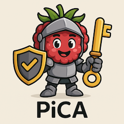
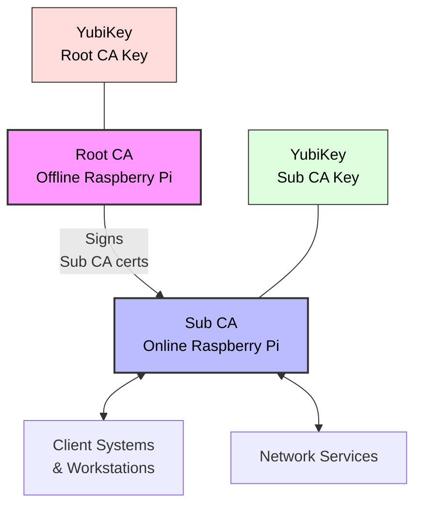

# PiCA - Raspberry Pi Certificate Authority



PiCA has an ambitious goal to be a comprehensive Certificate Authority management system designed to run on Raspberry Pi devices with YubiKey integration for secure key storage. The system consists of an offline Root CA and an online Sub CA, both with secure key storage in YubiKey PIV slots.

The current status of this project is extremely experimental... Features, APIs, and structure will most definitely change. 


## Features

- **Offline Root CA**: Secure, air-gapped certificate authority for maximum security
- **Online Sub CA**: Network-connected certificate authority for issuing end-entity certificates
- **YubiKey Integration**: All private keys stored on secure hardware using PIV slots
- **Software Key Fallback**: Development and testing without requiring physical YubiKeys
- **CFSSL Integration**: Built on CloudFlare's CFSSL for robust certificate management
- **Terminal UI**: Charm Bracelet-based TUI for managing the CAs directly on the devices
- **Web Interface**: Simple web interface for certificate management and CSR submission
- **Custom Raspberry Pi Images**: Purpose-built OS images for Root CA and Sub CA
- **Docker Support**: Containerized deployment option for the Sub CA

## Architecture

PiCA uses a two-tier CA hierarchy:

1. **Root CA (Offline)**
   - High-security, air-gapped Raspberry Pi
   - Private key stored in YubiKey PIV slot
   - Only used to sign Sub CA certificates
   - Custom minimal OS with no networking

2. **Sub CA (Online)**
   - Network-connected Raspberry Pi for certificate issuance
   - Private key stored in YubiKey PIV slot
   - Issues end-entity certificates for services, users, etc.
   - Web interface for certificate management

## Security Features

- **Hardware Key Storage**: All private keys stored on FIPS-certified YubiKey hardware
- **Air-Gapped Root CA**: Root CA is completely offline with no network connectivity
- **Limited Network Exposure**: Sub CA has minimal network exposure with strict firewall rules
- **Certificate Revocation**: Full CRL and OCSP support
- **Audit Logging**: Comprehensive logging of all operations

## Getting Started

See [INSTALL.md](INSTALL.md) for detailed installation instructions.

### Quick Start

1. Clone the repository:

   ```bash
   git clone https://github.com/billchurch/pica.git
   cd pica
   ```

2. Initialize the directories:

   ```bash
   make init
   ```

3. Build the applications:

   ```bash
   make build
   ```

4. Run the TUI:

   ```bash
   make run-cli
   ```

5. Or run the web server (for Sub CA):

   ```bash
   make run-web
   ```

## Raspberry Pi Images

PiCA provides custom Raspberry Pi OS images for both the Root CA and Sub CA, built using the rpi-image-gen tool. These images come pre-configured with all necessary software and security settings.

### Root CA Image

- Minimal Debian-based OS
- No networking services
- Firewall configured to block all connections
- YubiKey integration pre-configured
- PiCA CLI application pre-installed

### Sub CA Image

- Debian-based OS with essential services
- Minimal network exposure with strict firewall rules
- Web server for certificate management
- YubiKey integration pre-configured
- PiCA CLI and web applications pre-installed

## YubiKey Integration

PiCA uses YubiKeys for secure storage of CA private keys using the PIV application:

- Root CA key stored in slot 82 (9A)
- Sub CA key stored in slot 83 (9B)
- Keys never leave the secure hardware
- PIN and PUK protection for YubiKey access
- Management key for administrative operations

## Cryptographic Provider Abstraction

PiCA implements a flexible cryptographic provider abstraction layer:

- **Hardware-based (YubiKey)**: For production use, with all private keys securely stored on YubiKey hardware
- **Software-based**: For development, testing, and environments where YubiKeys are unavailable
- **Automatic detection**: Seamlessly uses hardware when available, falls back to software when needed
- **Environment control**: Force a specific provider type via `PICA_PROVIDER` environment variable

This abstraction allows developers to work with PiCA even without physical YubiKeys while maintaining the same security architecture in production deployments.

## CFSSL Configuration

PiCA leverages CFSSL for certificate operations with custom configurations:

- Predefined profiles for different certificate types (server, client, etc.)
- Strict validation rules
- Custom extensions
- Configurable lifetimes and policies

## Web Interface

The Sub CA includes a web interface for:

- Submitting Certificate Signing Requests (CSRs)
- Downloading issued certificates
- Viewing and listing certificates
- Revoking certificates
- Checking certificate status

## CLI Features

The terminal-based UI provides:

- Root CA initialization and management
- Sub CA initialization and signing
- Certificate issuance and revocation
- YubiKey configuration
- Certificate and CRL viewing

## Development

### Prerequisites

- Go 1.21 or newer
- YubiKey with PIV support
- rpi-image-gen (for building custom images)

### Building from Source

```bash
# Get the code
git clone https://github.com/billchurch/pica.git
cd pica

# Build the binaries
make build

# Run tests
make test
```

### Project Structure

- `cmd/`: Command-line applications
  - `pica/`: Main TUI application
  - `pica-web/`: Web server application
- `internal/`: Internal packages
  - `ca/`: Certificate authority implementation
  - `yubikey/`: YubiKey integration
  - `ui/`: Terminal UI components
- `pkg/`: Public packages
- `web/`: Web interface
  - `api/`: API server
  - `html/`: Web UI files
- `configs/`: Configuration files
- `rpi-images/`: Custom Raspberry Pi image configurations
  - `root-ca/`: Root CA image
  - `sub-ca/`: Sub CA image

## Documentation

Detailed documentation is available in the [docs](docs/) directory:

- [Architecture](docs/architecture.md)
- [Certificate Lifecycle](docs/certificate-lifecycle.md)
- [YubiKey Operations](docs/yubikey-operations.md)
- [Integration Guide](docs/integration-guide.md)
- [Usage Guide](docs/usage-guide.md)
- [YubiKey Setup](docs/yubikey-setup.md)
- [Provider Abstraction](docs/provider-abstraction.md)

## Contributing

Contributions are welcome! Please see [CONTRIBUTING.md](CONTRIBUTING.md) for guidelines.

## License

This project is licensed under the MIT License - see the [LICENSE](LICENSE) file for details.

## Acknowledgments

- [CloudFlare CFSSL](https://github.com/cloudflare/cfssl)
- [Raspberry Pi Foundation](https://www.raspberrypi.org/)
- [Charm](https://charm.sh/) for the TUI libraries
- [YubiKey](https://www.yubico.com/)
- [rpi-image-gen](https://github.com/raspberrypi/rpi-image-gen)
