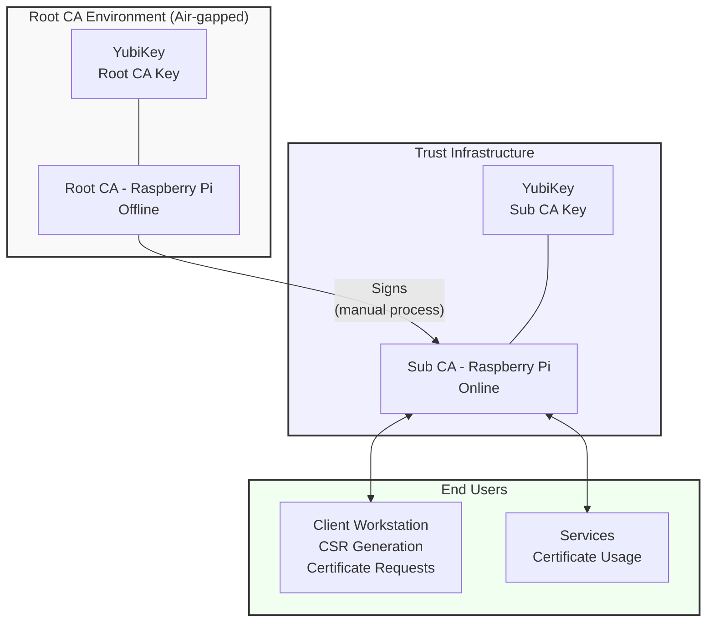
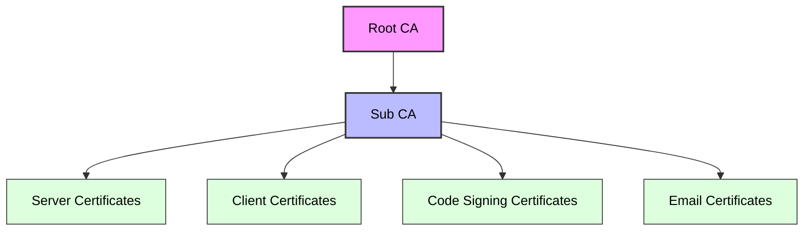
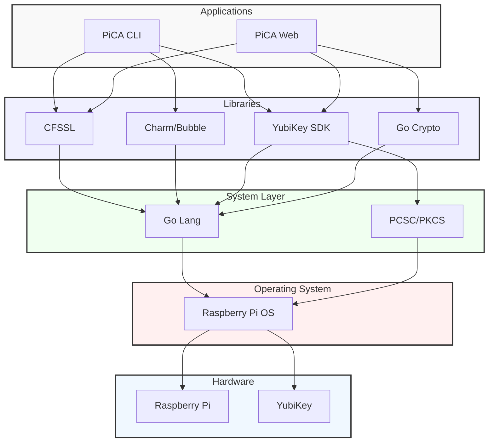
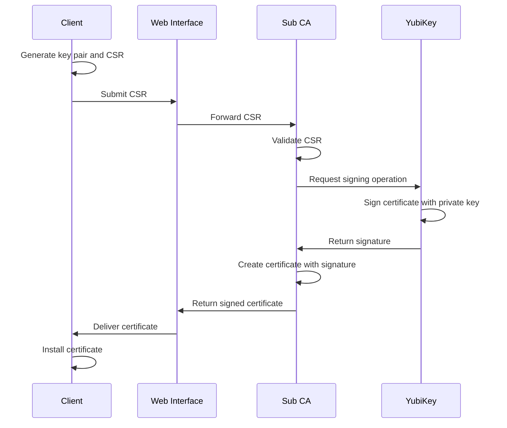
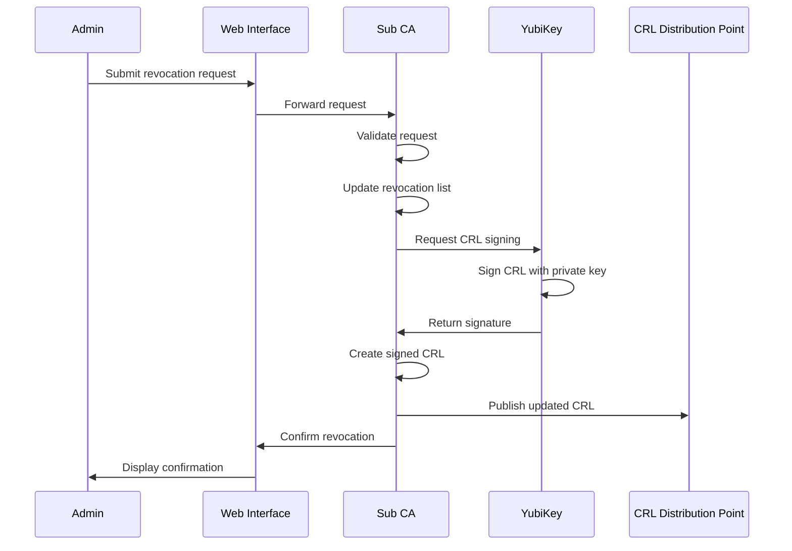
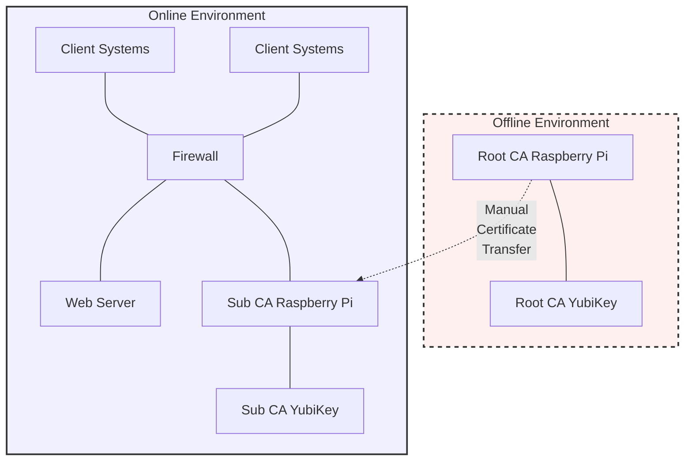
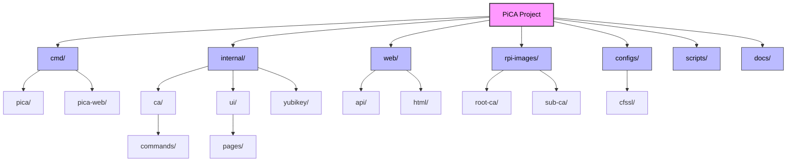
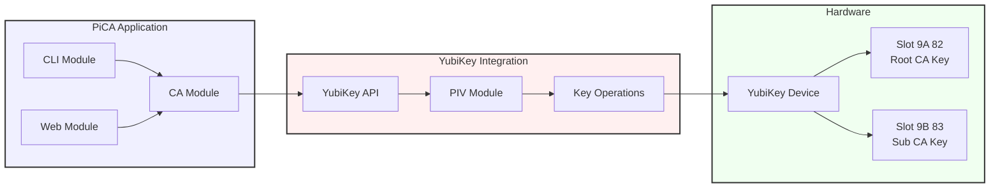

# PiCA Architecture Diagrams

This document contains the architecture diagrams for the PiCA Certificate Authority system using Mermaid syntax.

## System Overview

## Certificate Hierarchy

## Software Architecture

## Certificate Issuance Process

## Certificate Revocation Process

## Deployment Architecture

## Project Structure

## YubiKey Integration

