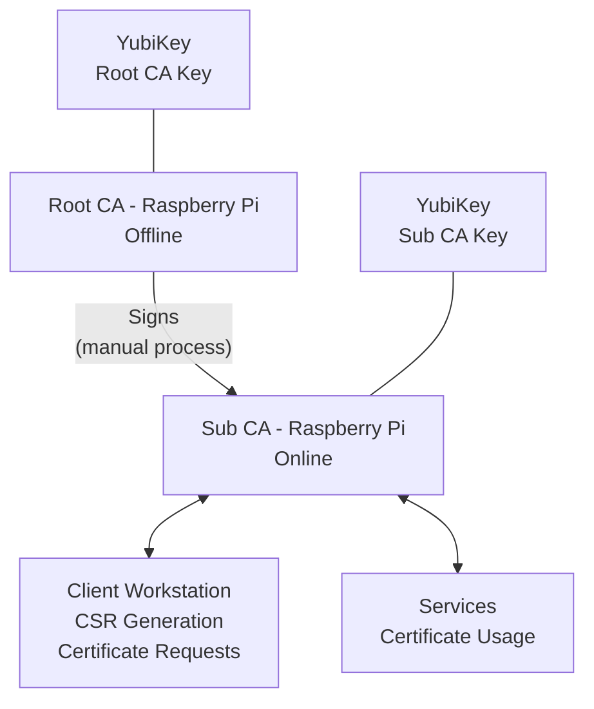
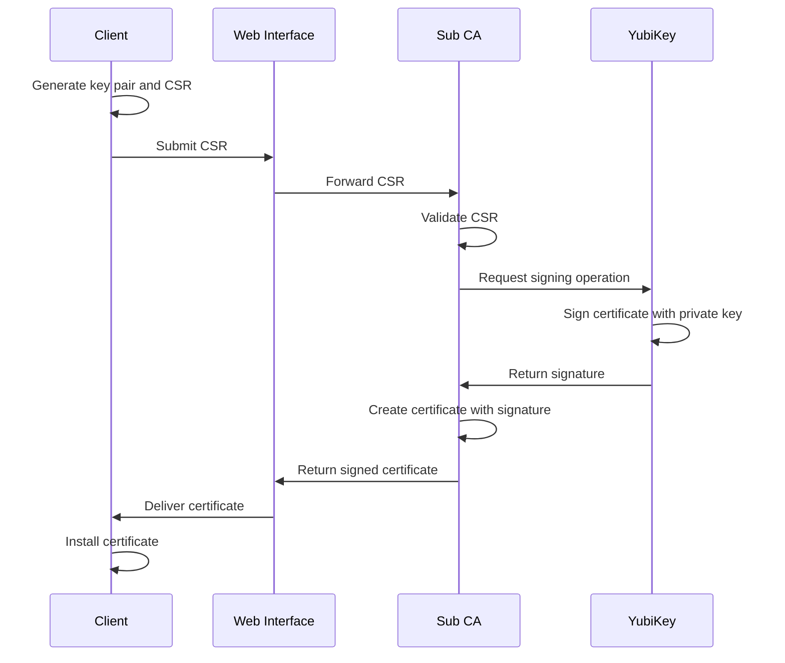
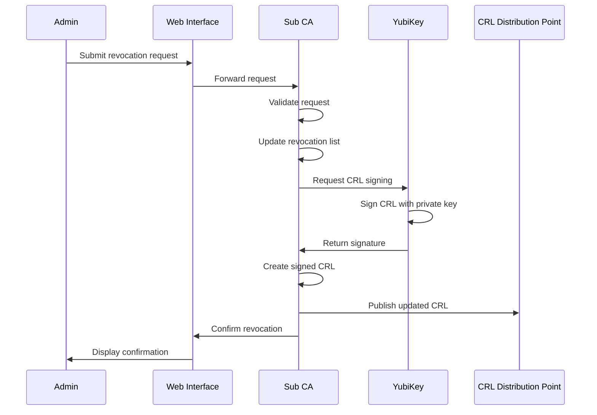
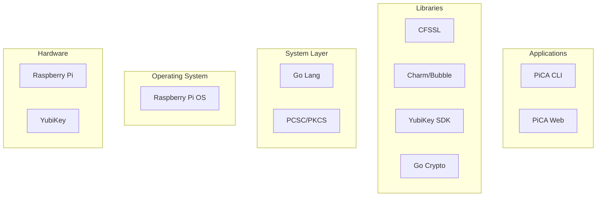
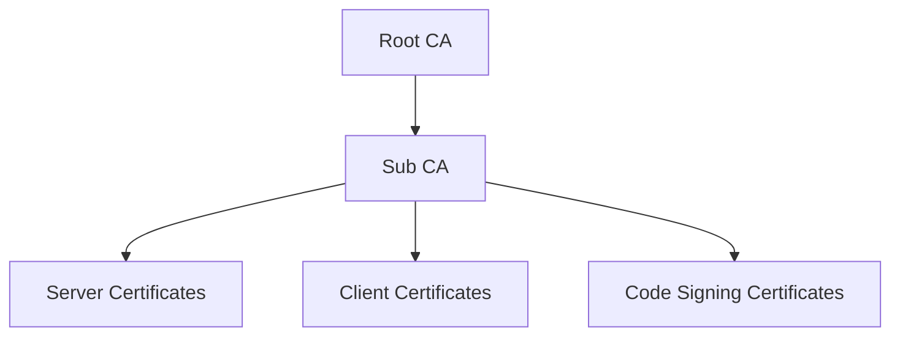

# PiCA Architecture

This document describes the architecture of the PiCA Certificate Authority system. For visual diagrams, see [Architecture Diagrams](architecture-diagrams.md).

## System Overview

The PiCA system consists of two main components:

1. **Root CA**: An offline, air-gapped Raspberry Pi that holds the root of trust
2. **Sub CA**: An online Raspberry Pi that issues end-entity certificates

Both CAs use YubiKeys for secure key storage, ensuring private keys never leave the hardware security module.

## Component Architecture

### Root CA

- **Hardware**: Raspberry Pi 4 (offline, air-gapped)
- **OS**: Custom minimal Debian-based OS
- **Key Storage**: YubiKey (PIV slot 82/9A)
- **UI**: Terminal-based UI (Charm)
- **Functions**:
  - Generate Root CA key
  - Sign Sub CA certificates
  - Maintain CRL
  - Secure backup management

### Sub CA

- **Hardware**: Raspberry Pi 4 (network-connected)
- **OS**: Custom Debian-based OS
- **Key Storage**: YubiKey (PIV slot 83/9B)
- **UI**: Terminal-based UI + Web Interface
- **Functions**:
  - Sign end-entity certificates
  - Process CSRs
  - Maintain CRL and OCSP
  - Certificate lifecycle management

### Client Interactions

1. Users generate CSRs on their workstations
2. CSRs are submitted via the web interface
3. Sub CA signs the CSRs and issues certificates
4. Certificates are distributed to clients and services
5. Revocation is managed through the web interface

## Security Architecture

### Key Protection

- All private keys are stored in FIPS-certified YubiKey hardware
- Keys never leave the secure hardware
- PIN and PUK protection for YubiKey access
- Management key for administrative operations

### Network Security

- Root CA has no network connectivity
- Sub CA has limited network exposure with strict firewall rules
- TLS encryption for all web traffic
- Client authentication for administrative access

### Physical Security

- Root CA kept in secure, offline location
- Physical access controls for both CAs
- Tamper-evident seals for hardware

### Operational Security

- Comprehensive audit logging
- Regular security reviews
- Certificate policy enforcement
- Intrusion detection

## Data Flow

### Certificate Issuance Process

### Certificate Revocation Process

## Software Architecture

### Core Components

- **CA Core**: Certificate authority functions using CFSSL
- **YubiKey Integration**: Hardware security module integration
- **Web API**: RESTful API for certificate management
- **TUI**: Terminal user interface for direct management
- **Web UI**: Web interface for remote management

### Software Stack

## Deployment Architecture

### Root CA Deployment

- Air-gapped Raspberry Pi with no network interfaces enabled
- Custom minimal OS image with only required packages
- Physical security controls
- Manual certificate signing process

### Sub CA Deployment

#### Bare Metal Option

- Raspberry Pi with restricted network access
- Custom OS image with security hardening
- Firewall allowing only necessary connections

#### Docker Option

- Containerized deployment on capable hardware
- Secure volume mounts for certificate storage
- USB passthrough for YubiKey access

## Certificate Profiles and Policies

### Certificate Hierarchy

### Certificate Profiles

- **Server Certificates**:
  - Server authentication
  - TLS web server usage
  - 1-year validity

- **Client Certificates**:
  - Client authentication
  - Email protection (optional)
  - 1-year validity

- **Code Signing Certificates**:
  - Code signing usage
  - 1-year validity

### Certificate Policies

- Strict validation of CSR fields
- Enforcement of naming conventions
- Key usage and extended key usage restrictions
- CRL distribution points included

## Configuration Management

- YAML-based configuration for all components
- Version-controlled configuration files
- Secure configuration storage
- Separate configurations for development and production

## Monitoring and Auditing

- Comprehensive logging of all CA operations
- Tamper-evident logs
- Regular audit report generation
- Monitoring of certificate expiry
- Alerts for security-relevant events

## Disaster Recovery

- Regular backup of configuration and certificate database
- Root CA key recovery procedures
- Documented emergency revocation procedures
- Business continuity planning
