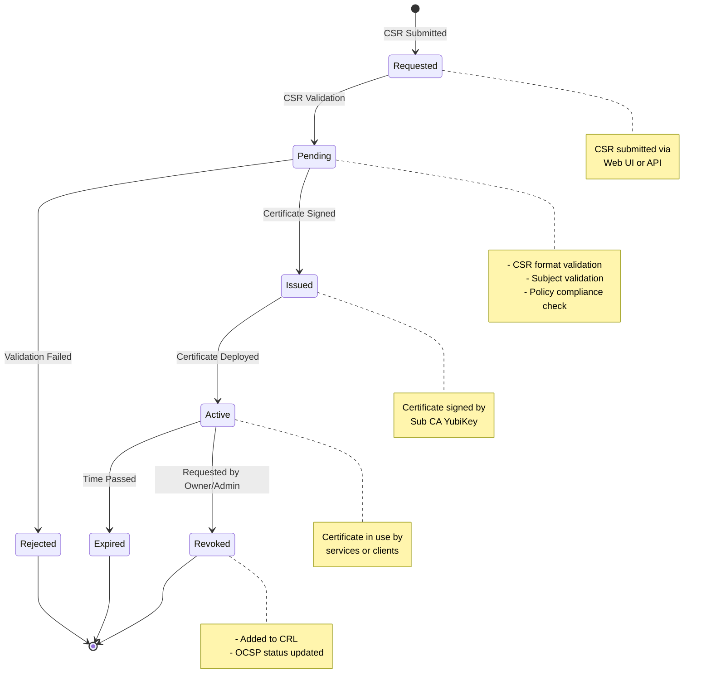
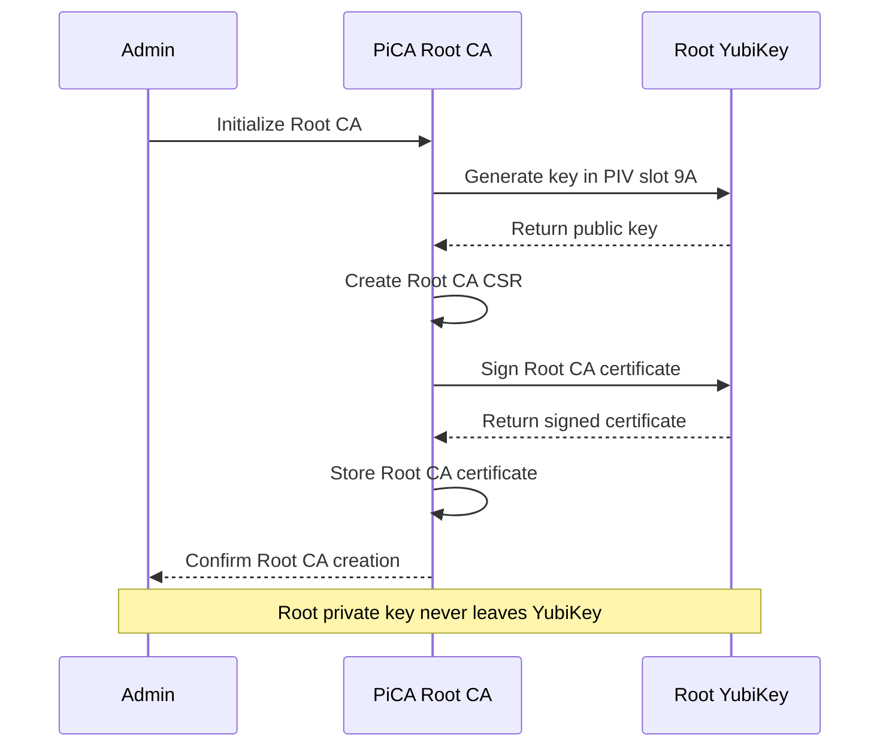
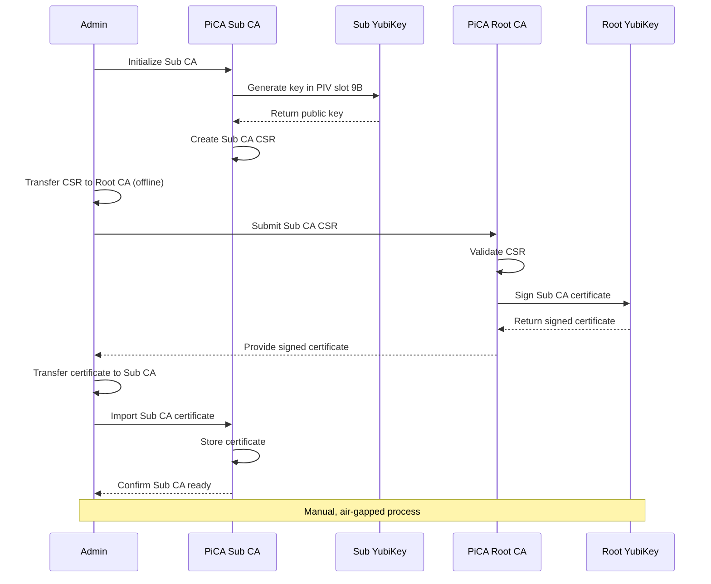
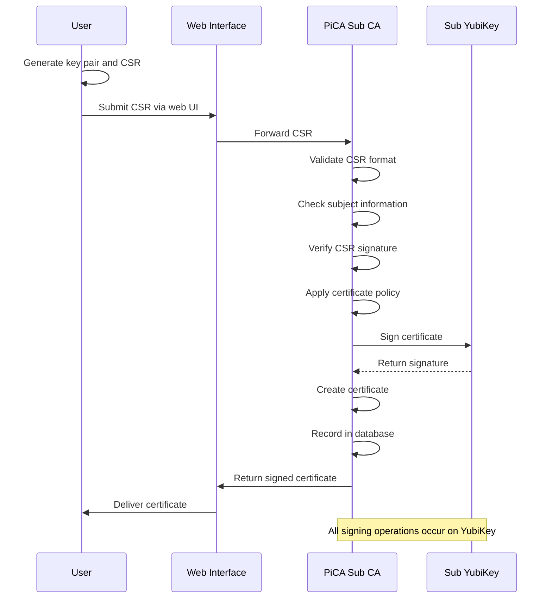
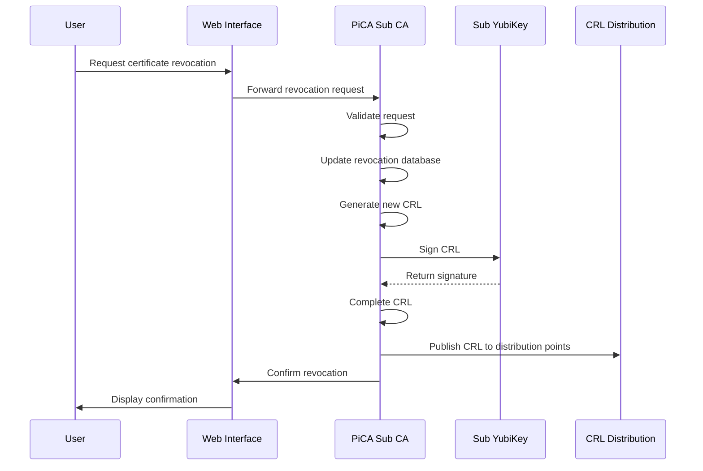
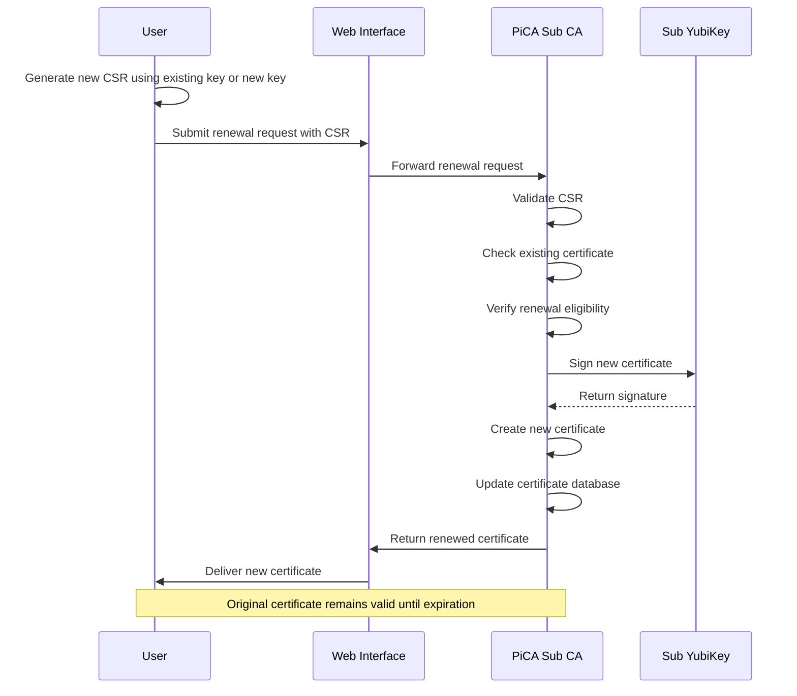
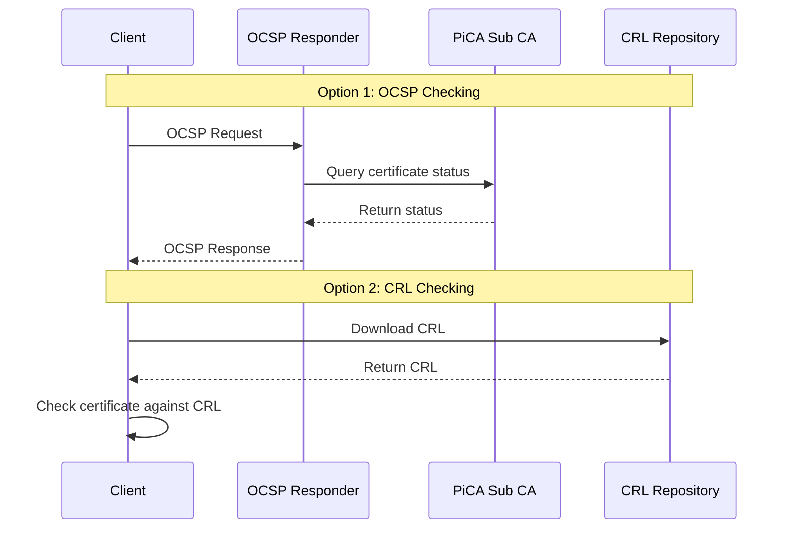
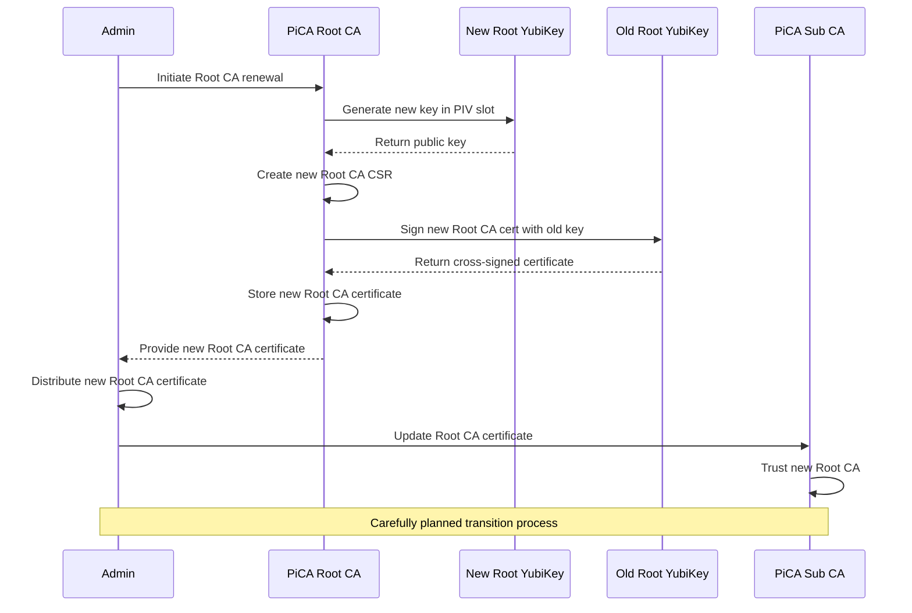

# Certificate Lifecycle in PiCA

This document visualizes the complete lifecycle of certificates in the PiCA system.

## Certificate Lifecycle Overview

## Root CA Certificate Creation Process

## Sub CA Certificate Creation Process

## End-Entity Certificate Issuance

## Certificate Revocation Process

## Certificate Renewal Process

## Certificate Status Checking

## Root CA Renewal Process (When Needed)

This document visualizes all the critical processes in the PiCA Certificate Authority system, showing how certificates are managed throughout their lifecycle.
