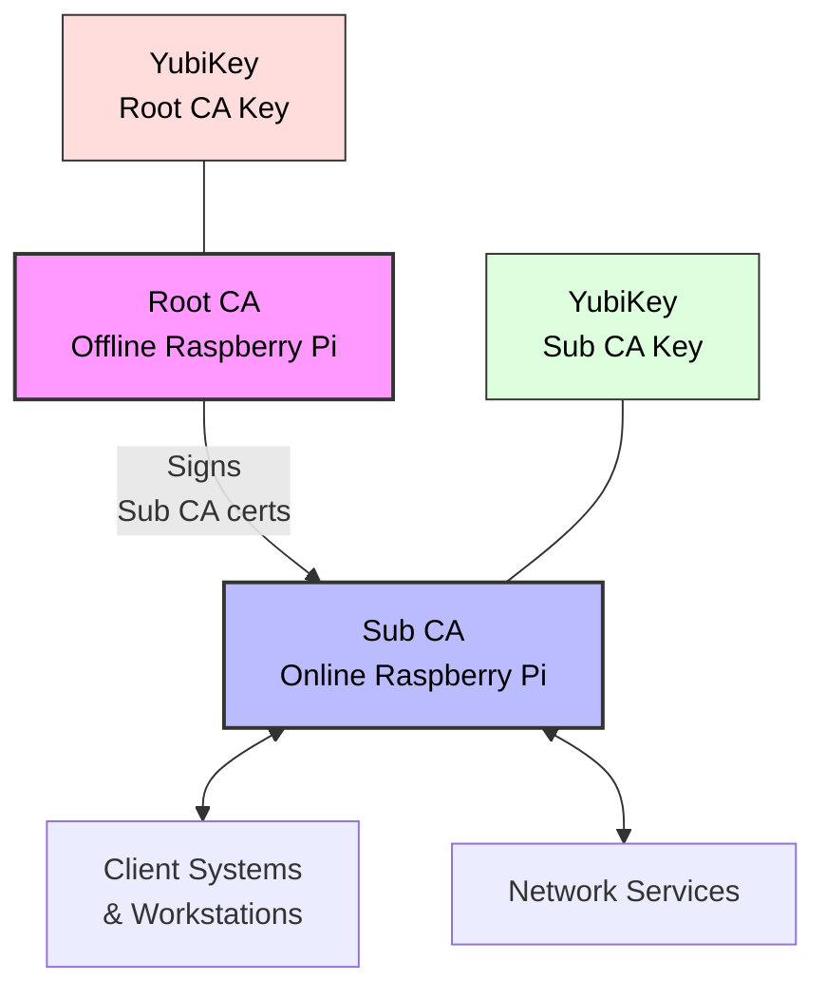
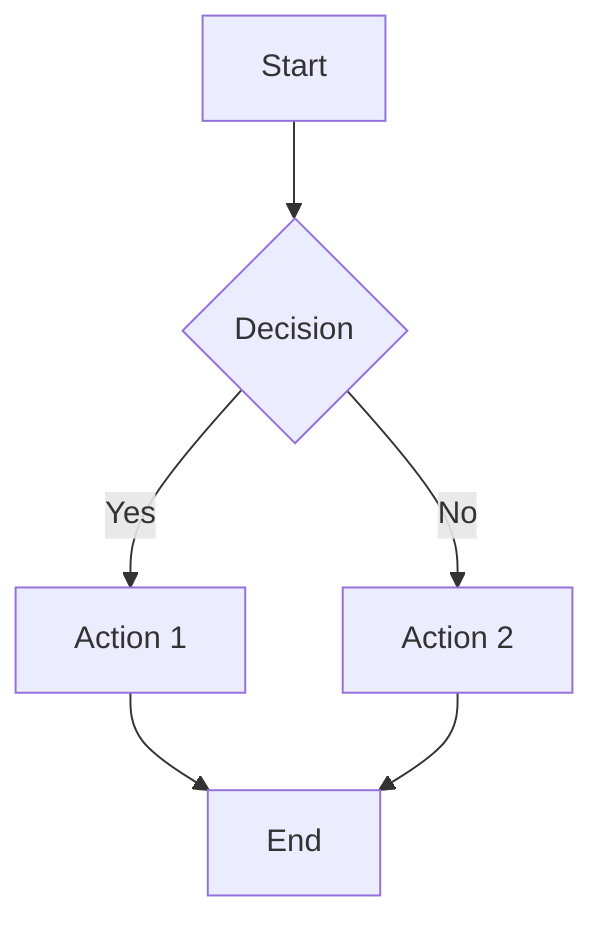

# PiCA Documentation

Welcome to the PiCA (Raspberry Pi Certificate Authority) documentation. This documentation provides detailed information about the architecture, setup, and usage of the PiCA system.

## Overview

PiCA is a comprehensive Certificate Authority management system designed to run on Raspberry Pi devices with YubiKey integration for secure key storage.

## Documentation Contents

### Architecture and Design

- [**Architecture**](architecture.md): Detailed architecture of the PiCA system
- [**Architecture Diagrams**](architecture-diagrams.md): Visual representations of the system architecture
- [**Certificate Lifecycle**](certificate-lifecycle.md): Visualizations of certificate lifecycles within PiCA
- [**Provider Abstraction**](provider-abstraction.md): Details on the cryptographic provider abstraction layer

### Setup and Configuration

- [**Configuration System**](configuration.md): How to configure PiCA using files, environment variables, and command-line flags
- [**YubiKey Setup**](yubikey-setup.md): Detailed instructions for setting up YubiKeys for use with PiCA
- [**Integration Guide**](integration-guide.md): Guidelines for integrating PiCA with existing infrastructure

### Operations

- [**Usage Guide**](usage-guide.md): Comprehensive guide for using PiCA
- [**YubiKey Operations**](yubikey-operations.md): In-depth explanation of YubiKey operations within PiCA

## Getting Started

If you're new to the PiCA system, we recommend starting with the following documents:

1. Read the [Architecture](architecture.md) document to understand the system design
2. Review the [Configuration System](configuration.md) to learn how to set up PiCA for your environment
3. Follow the [YubiKey Setup](yubikey-setup.md) guide to prepare your hardware security modules
4. Consult the [Usage Guide](usage-guide.md) for day-to-day operations

## Additional Resources

- [Project README](../README.md)
- [Installation Guide](../INSTALL.md)
- [Contributing Guidelines](../CONTRIBUTING.md)
- [Example Configurations](../configs/examples/README.md)

## Diagrams

All of the diagrams in this documentation are created using Mermaid, a JavaScript-based diagramming tool. This allows the diagrams to be maintained in code alongside the documentation, ensuring they stay up-to-date with the system.

Example:

## Feedback

If you find any issues with this documentation or have suggestions for improvement, please open an issue on our GitHub repository.
