# YubiKey Operations in PiCA

This document visualizes the YubiKey operations in the PiCA Certificate Authority system.

## YubiKey PIV Slot Allocation

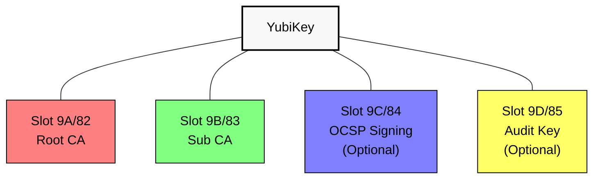

## YubiKey Setup Process

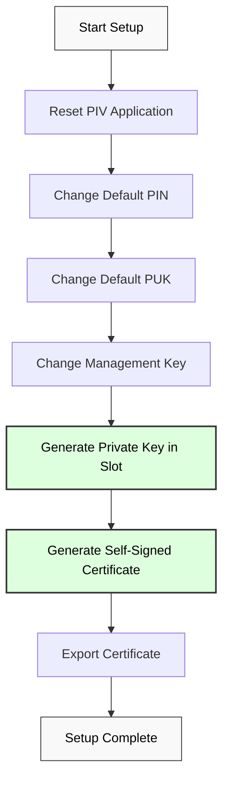

## YubiKey PIN Protection

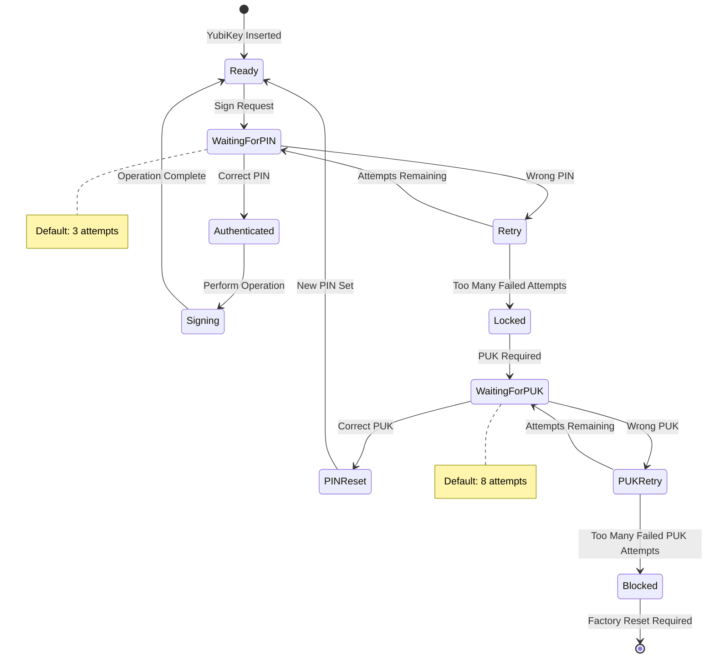

## Certificate Signing with YubiKey

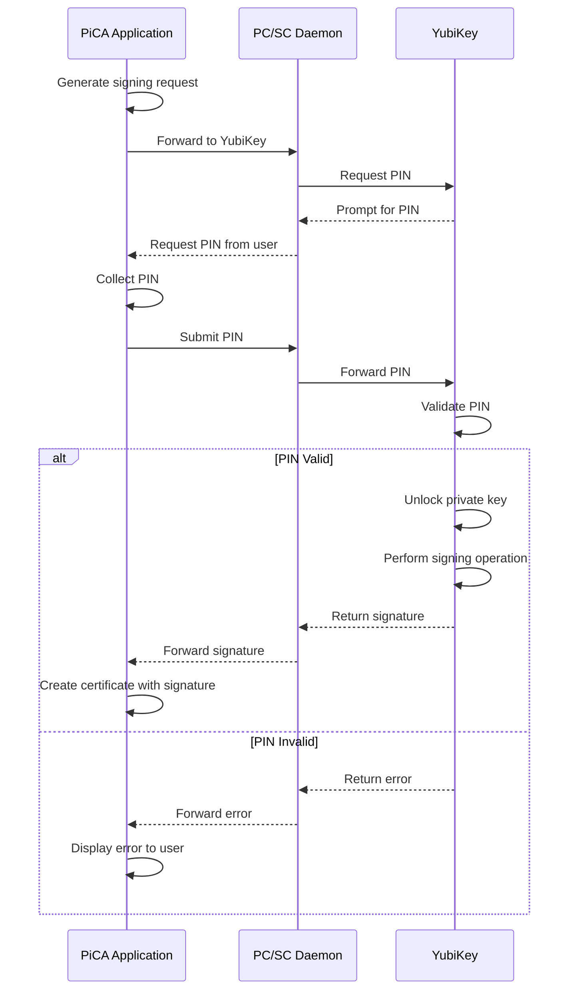

## YubiKey States and Transitions

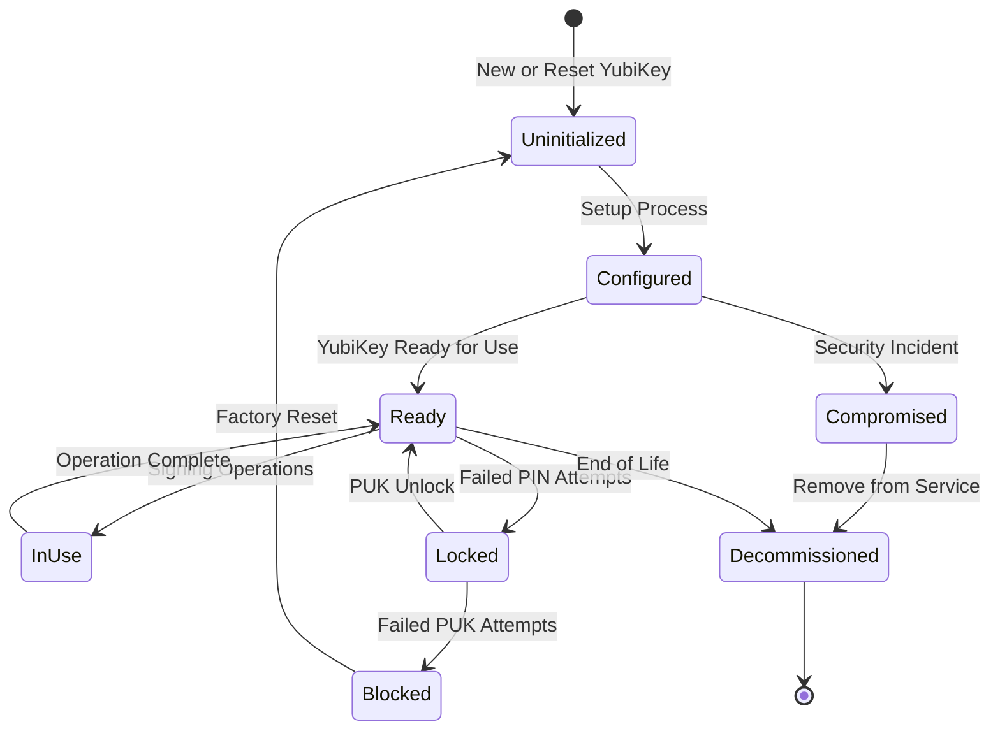

## YubiKey Management Workflow

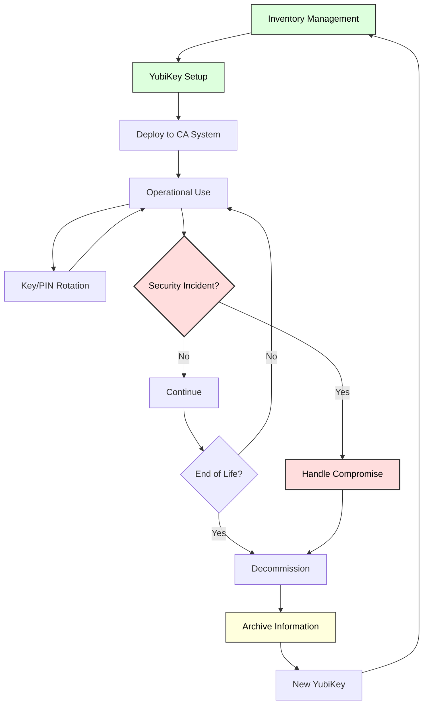

## YubiKey Touch Policy Options

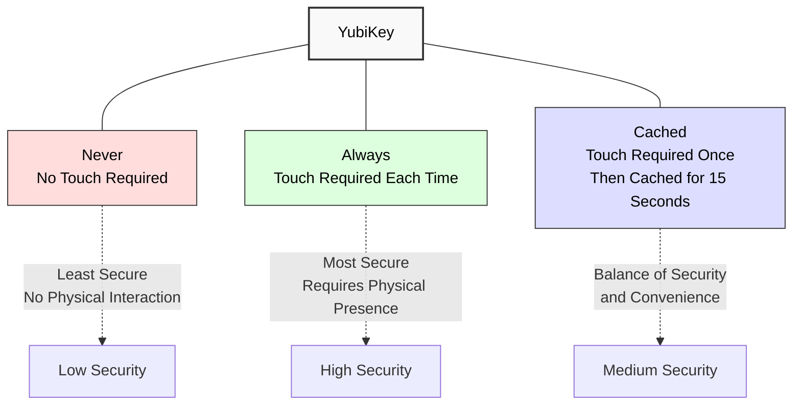

## YubiKey Backup and Recovery Strategy

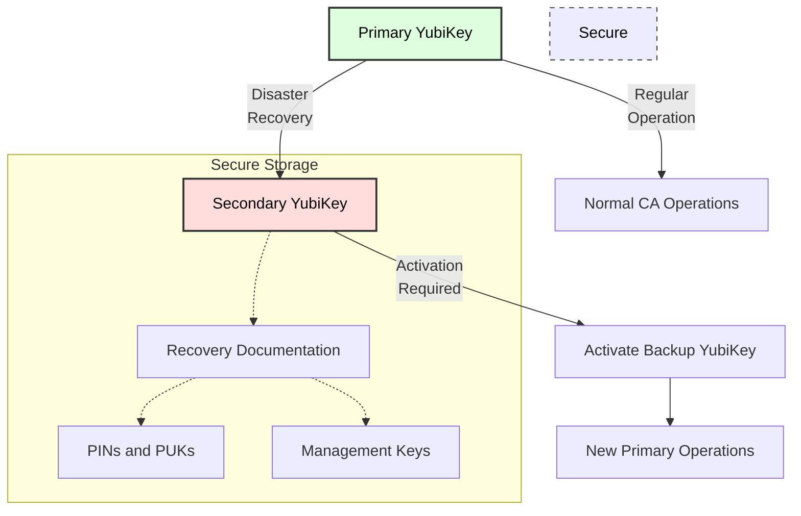

## PIN Protection for Management Key

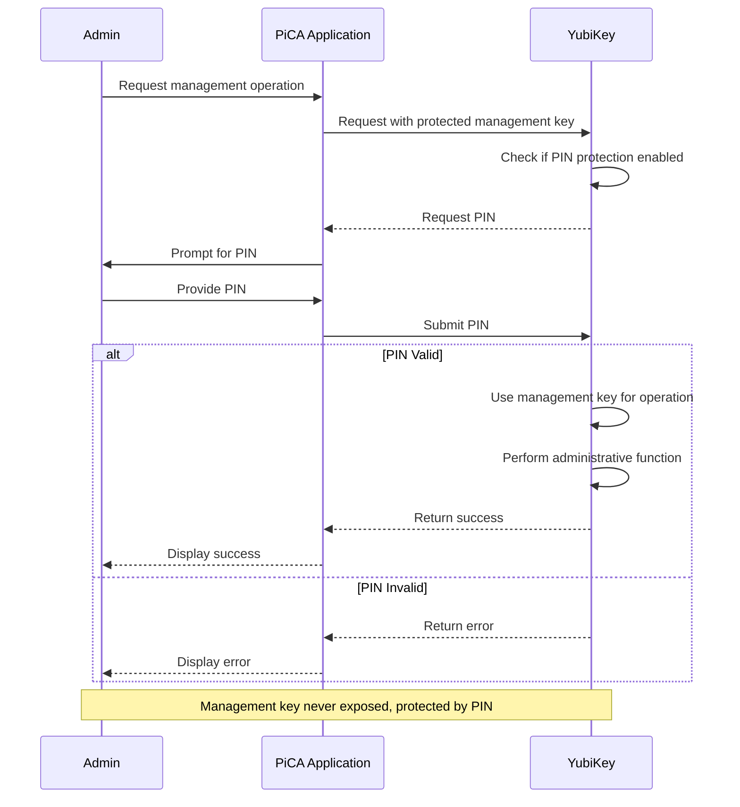

## Hardware-Based Attestation Process

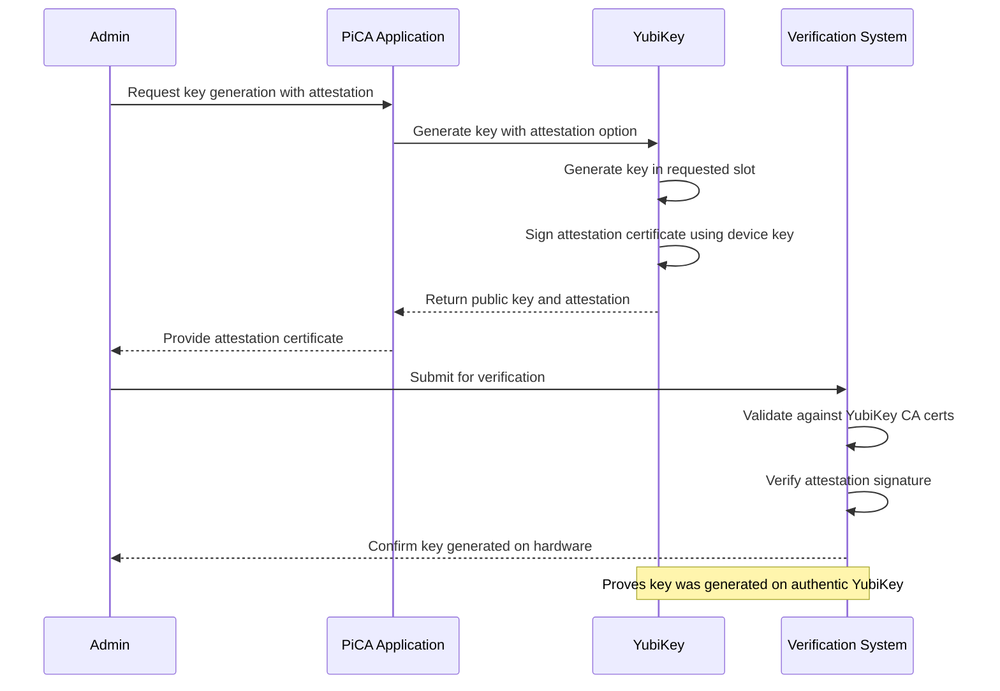

## YubiKey in PiCA Software Architecture

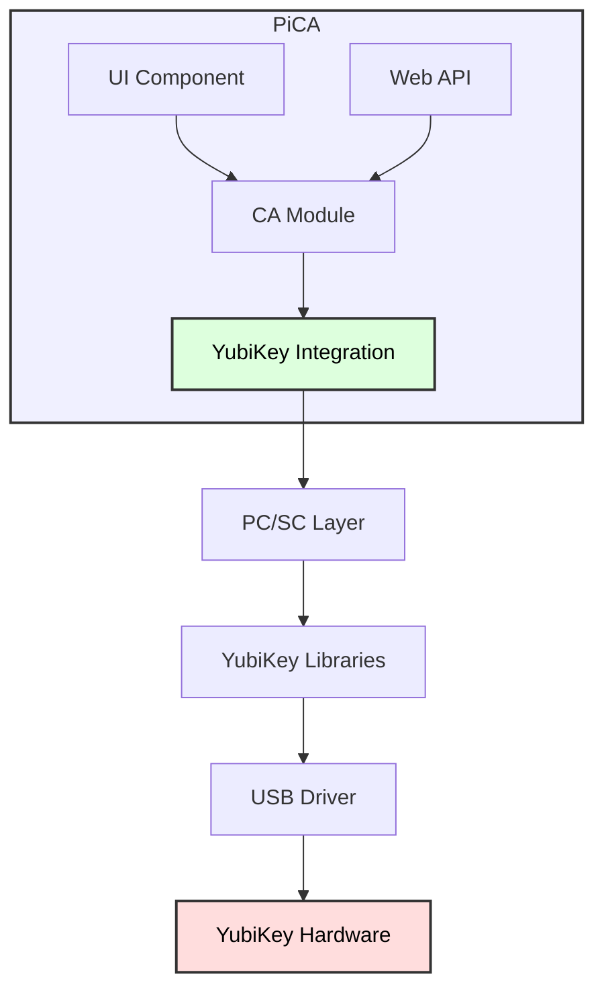

These diagrams provide comprehensive visualizations of how YubiKeys are integrated and used within the PiCA Certificate Authority system, from initial setup to operational use and security mechanisms.
